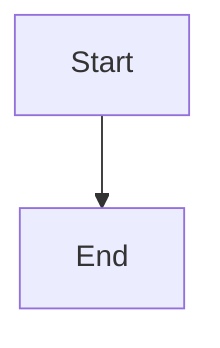

# Syntax Reference

This page covers how to write Markdown that converts cleanly to Confluence pages using md2cf. The tool converts Markdown to Atlassian Document Format (ADF) via [marklassian](https://github.com/jamsinclair/marklassian), so not every Markdown extension is supported.

## Supported features at a glance

| Feature | Syntax | Notes |
|---------|--------|-------|
| Headings | `# H1` through `###### H6` | H1 becomes page title |
| Bold | `**text**` | |
| Italic | `*text*` | |
| Strikethrough | `~~text~~` | |
| Inline code | `` `code` `` | |
| Code blocks | ` ```lang ` | Syntax highlighting via language identifier |
| Bullet lists | `- item` | Nesting supported |
| Numbered lists | `1. item` | Nesting supported |
| Tables | Pipe-delimited | Keep tables simple |
| Links | `[text](url)` | |
| Images | `` | Remote URLs recommended |
| Blockquotes | `> text` | |
| Horizontal rules | `---` | |
| Table of Contents | `## Table of Contents` | Auto-converted to Confluence TOC macro |
| Panels | `> [!NOTE]` | GFM alerts → Confluence panels |
| Expand/Collapse | `:::expand Title` | Collapsible sections |
| Mermaid diagrams | ` ```mermaid ` | Requires mmdc installed |

## Headings

Use ATX-style headings. Levels H1 through H6 are supported, though H1 through H3 are most useful for Confluence page structure:

```markdown
# Page Title (H1)
## Section (H2)
### Subsection (H3)
```

The first H1 heading becomes the Confluence page title by default. If you provide a `--title` flag, that value takes precedence.

## Text formatting

| Syntax | Result | Notes |
|--------|--------|-------|
| `**bold**` | **bold** | Double asterisks |
| `*italic*` | *italic* | Single asterisks |
| `~~strikethrough~~` | ~~strikethrough~~ | Double tildes |
| `` `inline code` `` | `inline code` | Backticks |
| `**_bold italic_**` | **_bold italic_** | Combined formatting |

## Lists

Both bullet and numbered lists are supported, including nesting:

```markdown
- Bullet item
  - Nested bullet
    - Deeply nested

1. Numbered item
   1. Sub-item
   2. Sub-item
```

## Code blocks

Fenced code blocks with a language identifier get syntax highlighting on Confluence:

````markdown
```typescript
const x = 42;
```
````

The language identifier (e.g. `typescript`, `bash`, `json`, `python`) maps to the corresponding Confluence code macro language. If no language is specified, the block renders as plain text.

## Tables

Standard pipe-delimited Markdown tables are supported:

```markdown
| Column A | Column B | Column C |
|----------|----------|----------|
| Value 1  | Value 2  | Value 3  |
```

Column alignment markers (`:---`, `:---:`, `---:`) are parsed but Confluence does not always honor them. Keep tables simple for best results.

## Links and images

```markdown
[Link text](https://example.com)

```

For images, remote URLs are embedded directly. Local image paths are not uploaded as attachments automatically — use remote URLs when possible.

## Blockquotes

```markdown
> This becomes a Confluence blockquote.
> Multi-line blockquotes are supported.
```

## Horizontal rules

Three hyphens on their own line:

```markdown
---
```

## Table of Contents

md2cf detects Table of Contents sections and replaces them with the Confluence TOC macro. Any heading named "Table of Contents", "TOC", or "Contents" triggers this:

```markdown
## Table of Contents
```

This is replaced by the Confluence `toc` macro, which generates a live, clickable table of contents from the page headings. You can optionally include a link list under the heading for local preview — it is stripped before sync.

## Panels (GFM Alerts)

GFM alert syntax is converted to Confluence panel nodes:

```markdown
> [!NOTE]
> This is an informational note.

> [!TIP]
> This is a helpful suggestion.
```

### Alert type mapping

| GFM Alert | Confluence Panel | Color |
|-----------|-----------------|-------|
| `[!NOTE]` | Info | Blue |
| `[!TIP]` | Success | Green |
| `[!IMPORTANT]` | Note | Purple |
| `[!WARNING]` | Warning | Yellow |
| `[!CAUTION]` | Error | Red |

Panel content supports full Markdown formatting: bold, italic, code, links, and lists all work inside panels.

## Expand / Collapse

Use the `:::expand` directive to create collapsible sections:

```markdown
:::expand Click to see details
Hidden content goes here.

- Lists work inside expand blocks
- So does **bold** and other formatting
:::
```

The title follows `:::expand` on the opening line. Everything between the opening and closing `:::` becomes the collapsible content. Expand blocks support all standard Markdown features inside them, including code blocks.

## Mermaid diagrams

Fenced code blocks with the `mermaid` language are rendered to PNG images and uploaded as page attachments:

````markdown

````

Mermaid rendering requires mmdc to be installed. Use `--skip-mermaid` to leave mermaid blocks as plain code. See [Mermaid Diagrams](./mermaid.md) for full details.

## What to avoid

The following Markdown features are not supported or may produce unexpected results:

### Raw HTML

Inline HTML tags are not converted to ADF:

```markdown
<div class="custom">This is ignored or rendered as plain text</div>
```

### Task lists (checkboxes)

GitHub-flavored task lists are not converted to Confluence task macros:

```markdown
- [ ] Unchecked item
- [x] Checked item
```

These render as regular bullet items with bracket characters.

### Footnotes

```markdown
This has a footnote[^1].

[^1]: Footnote content.
```

### Definition lists

```markdown
Term
: Definition
```

### Emoji shortcodes

GitHub-style `:rocket:` shortcodes are not converted. Use actual Unicode characters.

### Complex table features

These do not work:
- Merged cells (colspan/rowspan)
- Multi-line cell content
- Nested tables
- Tables with block-level content (lists, code blocks inside cells)

### Reference-style links

Reference-style links may not resolve correctly in all cases. Prefer inline links:

```markdown
<!-- Prefer this -->
[Link text](https://example.com)

<!-- Over this -->
[Link text][ref]
[ref]: https://example.com
```

## Structuring pages for Confluence

### Use H1 for the page title

Write your document with a single H1 at the top. The first H1 becomes the Confluence page title:

```markdown
# API Reference

## Authentication
...

## Endpoints
...
```

If your Markdown has no H1, the filename is converted to a title (e.g. `api-reference.md` → "Api Reference"). You can also override with `--title`.

### Add a Table of Contents for long pages

For pages with many sections, include a TOC heading:

```markdown
# Project Documentation

## Table of Contents

## Overview
...
```

### Keep heading levels sequential

Avoid skipping levels (e.g. jumping from H2 to H4). Sequential headings produce a cleaner page outline.

### Separate sections with horizontal rules

Horizontal rules translate to visual dividers on Confluence:

```markdown
## Section One

Content here.

---

## Section Two

More content.
```
