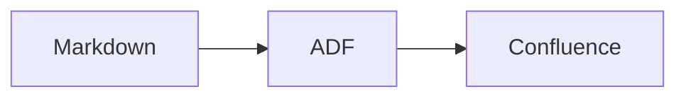

# Mermaid Diagrams

md2cf automatically detects Mermaid code blocks in your Markdown and renders them to PNG images that are uploaded as Confluence page attachments.

## How it works

1. md2cf scans the Markdown for ` ```mermaid ` fenced code blocks.
2. Each block is rendered to a PNG image using the bundled [mermaid-cli](https://github.com/mermaid-js/mermaid-cli) (`mmdc`).
3. The PNG is uploaded as an attachment to the Confluence page.
4. The code block is replaced in the ADF output with an inline image and a collapsible "View Mermaid Source Code" expand block.

If rendering fails for a particular block, the expand block is still inserted with an error message so the source code is not lost.

## Example

A Markdown file containing:

````md

````

will produce a rendered PNG diagram on the Confluence page with a collapsible section showing the original Mermaid source.

## mmdc resolution

md2cf searches for the `mmdc` binary in this order:

1. **Sibling to the `md2cf` binary** — npm places all dependency binaries in the same `.bin` directory.
2. **CWD `node_modules/.bin`** — covers development and monorepo scenarios.
3. **Global PATH** — fallback if `mmdc` is installed globally.

If `mmdc` cannot be found, mermaid blocks are left as-is (no rendering occurs).

## Error handling

- Each diagram has a 60-second render timeout.
- Temporary `.mmd` and `.png` files are cleaned up after each render.
- Failed renders insert an expand block titled "Mermaid Source (render failed: ...)" so the source is preserved.
