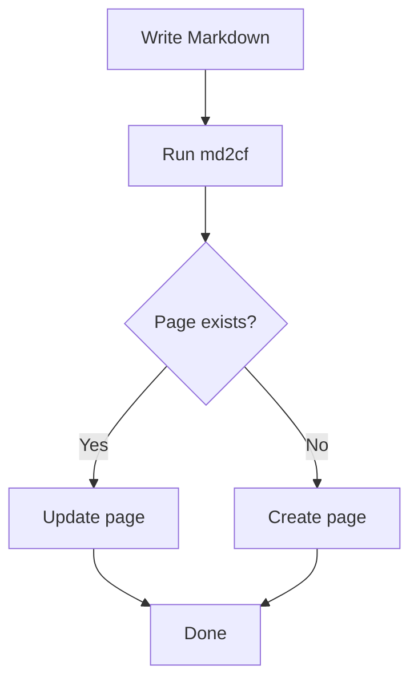
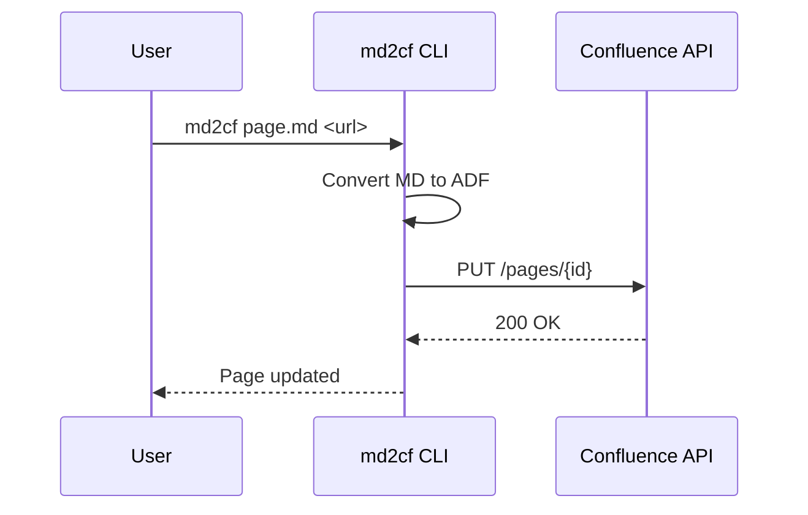

# Sample Page

This page is a live example of all Markdown features supported by md2cf. You can sync this file directly to Confluence to see how each feature renders.

To generate a local copy, run `md2cf init` — it creates a `confluence-sample.md` file in your current directory.

---

## Table of Contents

## Text Formatting

Standard inline formatting works as expected:

- **Bold text** using double asterisks
- *Italic text* using single asterisks
- ~~Strikethrough text~~ using double tildes
- `Inline code` using backticks

You can combine formatting: **_bold and italic_**, **`bold code`**, or *`italic code`*.

Paragraphs are separated by blank lines. This is a second paragraph to show
how multi-line text flows naturally into Confluence.

## Lists

### Bullet Lists

- First item
- Second item
  - Nested item A
  - Nested item B
    - Deeply nested item
- Third item

### Numbered Lists

1. Step one
2. Step two
   1. Sub-step A
   2. Sub-step B
3. Step three

### Mixed Nesting

- Overview
  1. First consideration
  2. Second consideration
- Details
  - Sub-detail A
  - Sub-detail B

## Code

Use backticks for inline code: `const result = await fetchData();`

Fenced code blocks with a language identifier get syntax highlighting on Confluence:

```typescript
interface PageConfig {
  title: string;
  spaceKey: string;
  parentId?: string;
}

async function syncPage(config: PageConfig): Promise<void> {
  const markdown = readFileSync("page.md", "utf-8");
  console.log(`Syncing "${config.title}" to ${config.spaceKey}`);
}
```

```bash
# Install md2cf globally
npm install -g md2cf

# Configure credentials
md2cf config

# Sync a file to Confluence
md2cf README.md https://mycompany.atlassian.net/wiki/spaces/ENG/pages/12345
```

```json
{
  "email": "user@company.com",
  "baseUrl": "https://mycompany.atlassian.net"
}
```

## Tables

Tables use standard Markdown pipe syntax:

| Feature        | Status    | Notes                                  |
|----------------|-----------|----------------------------------------|
| Bold / Italic  | Supported | Use `**text**` or `*text*`             |
| Strikethrough  | Supported | Use `~~text~~`                         |
| Code blocks    | Supported | Fenced blocks with language identifier |
| Tables         | Supported | Pipe-delimited columns                 |
| Images         | Supported | Local paths and remote URLs            |
| Mermaid        | Supported | Requires mmdc installed                |
| TOC            | Supported | Auto-converted to Confluence macro     |

## Links and Images

### Links

- [Atlassian Developer Documentation](https://developer.atlassian.com/cloud/confluence/)
- [md2cf on GitHub](https://github.com/sujeet-pro/markdown-to-confluence-sync)
- [md2cf on npm](https://www.npmjs.com/package/md2cf)

### Images

Remote images by URL:


## Blockquotes

> This is a blockquote. Use it to call out important information or
> to quote external sources.
>
> Blockquotes can span multiple paragraphs.

## Panels

GFM alert syntax is converted to Confluence panels:

> [!NOTE]
> This is an informational note. Use it for general tips or supplementary details.

> [!TIP]
> This is a tip. Use it for helpful suggestions or best practices.

> [!IMPORTANT]
> This is an important callout. Use it for critical information the reader should know.

> [!WARNING]
> This is a warning. Use it to alert readers about potential pitfalls.

> [!CAUTION]
> This is a caution. Use it for actions that could lead to data loss or errors.

## Expand/Collapse

Use expand blocks to hide content behind a toggle:

:::expand Click to see implementation details
This content is hidden by default. The reader can click the title to expand it.

- Step 1: Configure your settings
- Step 2: Run the sync command
- Step 3: Verify on Confluence
:::

:::expand API Response Example
```json
{
  "status": "ok",
  "data": {
    "id": "12345",
    "title": "My Page"
  }
}
```
:::

## Other Features

### Horizontal Rules

Use three hyphens on their own line to create a horizontal rule:

---

### Headings Hierarchy

Use heading levels H1 through H3 for page structure. The H1 heading is used as the
page title by default. H2 and H3 headings organize the page content and appear in
the Confluence Table of Contents macro.

### Mermaid Diagrams

When mmdc is installed, mermaid code blocks are rendered as PNG images and uploaded
as attachments. The original source is preserved in a collapsible block.





---

*This sample was generated by `md2cf init`. Edit it to match your content, then sync:*

```bash
md2cf confluence-sample.md <your-confluence-page-url>
```
